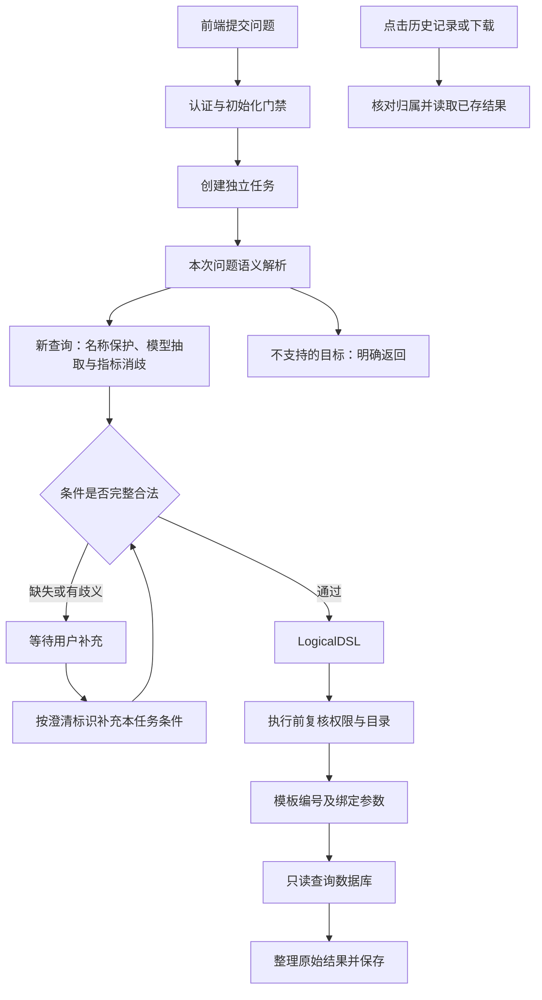

# 关键代码阅读指南

这份指南面向掌握基础 Python、第一次维护本项目的开发者。先理解“数据从哪里来、谁负责校验、在哪里执行”，再看每一个表达式。文件内的中文注释解释关键边界，本文集中解释调用顺序和常见语法。

当前系统维护单次可信问数、当前任务澄清和历史结果查看/导出。`SemanticEngine.analyze` 中的 analyze 是“语义解析”，不是已退出运行链的归因分析。跨任务继承、历史指代和追问执行已经退出；历史兼容字段和数据库迁移保留用于读取旧记录。

## 1. 先认识各层

结构化基础查询从 `api/routes/tasks.py:execute_basic_query` 进入：`BasicQuerySpec`
只接受目录编码、显式日期与选取方式，`submit_question` 建立 `LOGICAL_DSL` 任务后直接调用
`QueryExecutionApplicationService.execute`。没有意图或槽位模型调用，权限、目录、SQL 模板、
结果证据和事务仍走公共执行链；`all_in_range` 复用趋势取数模板，不计算同比或汇总。
基础查询幂等重放会重新核对权限/目录，返回持久化原值而不重复执行 SQL。

自然语言入口继续使用模型理解外围操作。`MetricResolution.ambiguous_spans` 保存已完整匹配但
编码不唯一的目录文字位置，`_protect_resolved_entities` 将其替换为无编码占位符，候选保留供
澄清。未完整的具体名称不会因短别名而被隐藏，名称之外的操作也不会被删除。

保护后再经 `_opaque_model_entities` 把正式编码替换为请求内的 `M1/O1`，映射留在后端。
槽位模型不接收完整机构候选，避免名称或编码中的“汇总、排名、较上月”重新成为操作依据。
已经命中的指标不走原句回退拆分，未覆盖指标短语仍须模型提取和目录消歧。
`_validate_operation_evidence` 核对 `options.operation_evidence` 与非空 `ops` 一一对应，
且引用来自标签外；失败时保留操作并澄清，不改写为基础取值。该函数只验证出处，不以
中文关键词判断操作类型；“谁最高”等语义仍由模型理解。

| 位置 | 主要职责 | 阅读时关注什么 |
| --- | --- | --- |
| `frontend-vue/src/` | 页面、请求、状态和结果展示 | 何时发送请求，如何展示待补充与失败 |
| `backend-next/src/ask_metric/api/` | HTTP 接口、请求校验、认证与依赖装配 | URL 对应哪个服务，身份从哪里取得 |
| `application/` | 编排一次业务操作 | 任务归属、状态/版本、事务、错误处理 |
| `domain/` | 查询结构、匹配、规范化及计算规则 | 模型建议如何变成受控条件 |
| `infrastructure/` | 数据库、HTTP 模型、模板与配置的具体实现 | 外部调用、资源释放、绑定参数和超时 |

这是职责划分，不是完全隔离的架构：目前部分 domain 模块仍直接引用 infrastructure。理解现状后再逐步改善，不应为了目录形式一次性重写核心流程。

## 2. 一次提问怎样执行



建议按以下顺序打开代码。第一遍只看列出的入口，不必读完整文件。

| 顺序 | 文件与入口 | 它完成什么 |
| --- | --- | --- |
| 1 | [BackendNextChatPanel.vue](../frontend-vue/src/components/chat/BackendNextChatPanel.vue)：`runQuestion`、`handleTaskAdvance`、`executeTask` | 创建任务后请求解析；根据返回状态进入澄清、执行或结果展示 |
| 2 | [routes/tasks.py](../backend-next/src/ask_metric/api/routes/tasks.py)：`submit_question`、`analyze_query_task`、`execute_query_task` | 将 HTTP 请求转换为业务命令，附带可信身份、幂等键和版本号 |
| 3 | [dependencies.py](../backend-next/src/ask_metric/api/dependencies.py)：`require_actor`、`get_query_task_service`、`get_semantic_task_service`、`get_query_execution_service` | 核对身份，并把模型、目录、权限和数据库实现交给服务 |
| 4 | [task_service.py](../backend-next/src/ask_metric/application/task_service.py)：`submit_question`、`_submit_question_once` | 核对会话归属和重复请求，创建独立任务，不读取历史条件 |
| 5 | [semantic_task_service.py](../backend-next/src/ask_metric/application/semantic_task_service.py)：`analyze` | 解析当前问题，拒绝不支持的目标 |
| 6 | [semantic_engine.py](../backend-next/src/ask_metric/domain/semantic_engine.py)：`analyze`、`_fuzzy_candidates` | 保护名称、调用模型、规范化槽位，对模糊指标做候选召回和消歧 |
| 7 | [semantic_workflow.py](../backend-next/src/ask_metric/application/semantic_workflow.py)：`advance_slot_frame` | 缺条件则生成澄清；完整时生成 LogicalDSL |
| 8 | [query_execution_service.py](../backend-next/src/ask_metric/application/query_execution_service.py)：`execute`、`_prepare`、`_build_governed_plan` | 复核权限与目录，登记执行，查询并保存结果 |
| 9 | [query_execution.py](../backend-next/src/ask_metric/domain/query_execution.py)：`QueryPlanner.build` | 选择支持的查询形态、模板编号和业务参数 |
| 10 | [templates.py](../backend-next/src/ask_metric/infrastructure/query/templates.py)、[mysql.py](../backend-next/src/ask_metric/infrastructure/query/mysql.py)、[inceptor.py](../backend-next/src/ask_metric/infrastructure/query/inceptor.py) | 从登记模板取得 SQL，由驱动绑定业务值，再执行只读查询 |

例如“查询某机构某天的存款余额”，最终应得到正式指标编码、合法机构集合和确定日期。模型负责理解用户意思；目录校验、权限复核和查询规划共同决定能否执行。向量相似度高不等于条件已确认，更不等于有权查询。

查询能力由结构判断，不再扫描原句中的“明细、流水”等词直接拒绝。正式名称会先被保护；
模型必须明确返回 `ops`，纯取值才是 `[]`。漏字段或操作/筛选等格式错误会中止解析，不能删掉错误项继续查。
合法但不支持的操作在规划阶段返回不支持，业务 SQL 不会执行。`detail`、`drill_down` 仍是用来表达
并拒绝超范围请求的类型，不代表系统提供了交易查询功能。完整但理解错误的模型输出仍需真实模型用例验证。

## 3. 启动与向量初始化

从 [main.py](../backend-next/src/ask_metric/main.py) 的 `create_app` / `lifespan` 开始：

1. 创建共享 HTTP 客户端、模型并发信号量和目录向量缓存。
2. 后台线程运行 `QueryInitialization.run(warm_catalog)`；回调读取配置和指标目录，分批生成目录向量。
3. [query_initialization.py](../backend-next/src/ask_metric/infrastructure/model/query_initialization.py) 保存 initializing、ready、failed 及进度；失败等待后重试。
4. [query_readiness.py](../backend-next/src/ask_metric/api/query_readiness.py) 在服务端拦截尚未就绪的问数操作；前端 [useQueryReadiness.ts](../frontend-vue/src/composables/useQueryReadiness.ts) 轮询并控制提示与按钮。
5. 应用关闭时通知预热停止，等待线程结束，再关闭共享客户端。

`app.state` 是当前进程的共享资源，不是跨服务器缓存。使用多个 worker 或实例时，每个进程分别初始化、分别占用向量内存。关闭 Embedding 时不需要生成目录向量。

[catalog_vectors.py](../backend-next/src/ask_metric/infrastructure/model/catalog_vectors.py) 中的矩阵可以看作“一维数组按每 1024 个数划成一行”。`_vectors[text]` 保存行号，`memoryview` 将对应区间作为只读窗口交给检索，不复制整行浮点数。目录变更会建立新一代缓冲区，旧请求仍可读旧缓冲区；模型配置变化则使旧向量失效。

一万行、1024 维、每维 4 字节，数值区是 `10000 × 1024 × 4 = 40,960,000` 字节，约 39.06 MiB。实际进程内存还包含目录文本、索引、临时模型响应、旧缓冲区和其他业务对象。向量的 float32 精度与业务查询数值的存储、计算和展示精度是两回事。

## 4. 当前任务澄清与历史结果怎么区分

[task_service.py](../backend-next/src/ask_metric/application/task_service.py) 的 `submit_clarification`
按任务、版本、澄清编号校验补充回答，调用 `apply_clarification_answers` 只修改该任务的槽位。
`advance_slot_frame` 再检查缺失项；条件齐全才进入查询规划。它不读取其他任务的条件。

每次调用 `submit_question` 都建立独立任务。会话编号只是历史列表的归属，不是继承条件的依据。
例如第一次完整查询常熟数据，完成后再问“那江阴呢？”，新的任务只有本次识别到的机构，需补指标和日期。

历史入口是 `get_task`、`get_conversation`、`export_task_result` 和 `export_conversation`，按用户归属读取已存内容，
不调用模型或业务查询库。[result_repository.py](../backend-next/src/ask_metric/application/result_repository.py)
只负责生成、保存结果证据。旧跨任务任务由 [query_scope.py](../backend-next/src/ask_metric/application/query_scope.py)
阻止继续执行，但仍可查看结果。旧归因证据还按当前机构权限复核。

## 5. 读懂本项目常见 Python 写法

### lambda：只返回一个表达式的小函数

本项目相似度排序使用：

```python
key=lambda item: -item[1]
```

它可以展开成下面的写法，含义相同：

```python
def score_key(item):
    return -item[1]

sorted(candidates, key=score_key)
```

这里 item 是 `(指标对象, 相似度)`，`item[1]` 是分数。排序默认升序，返回负分数就会让高分排前面。`key=lambda item: (-item.score, item.item.code)` 则先按分数降序，同分时按编码排序，让顺序稳定。

`lambda: datetime.now(UTC)` 没有参数，每次调用才读取时间。不要改成 `datetime.now(UTC)` 作为默认参数，否则默认值会在函数定义时计算，后续调用可能一直使用旧时间。

简短排序键适合 lambda；包含多个动作或重要业务含义的回调适合具名函数。启动代码中的 `warm_catalog` 就采用具名函数。

### 推导式、生成器与解包

```python
names = [item.name for item in metrics if item.code in allowed]
```

相当于创建空列表，循环 metrics，符合条件就 `append(item.name)`。圆括号写法 `(item.name for item in metrics)` 是生成器，按需产生元素，常用于 `sum`、`any`、`next` 等函数。

- `any(...)`：只要有一个条件为真就停止并返回 True。
- `next((item for item in items if ...), None)`：找第一个符合条件的元素；找不到返回 None。
- `zip(metrics, vectors, strict=True)`：按位置一一配对，长度不同就报错，避免悄悄截断。
- `enumerate(items)`：同时取得下标和元素。
- `normalized_term := normalize_semantic_text(term)`：计算一次并保存规范化名称，后续条件复用该值；当前任务的目录匹配使用此写法。
- `[*first, *second]`：把两个序列的元素展开到新列表。
- `{**original, "orgs": new_orgs}`：复制字典字段并覆盖 orgs；这是浅复制，嵌套列表仍可能共享。需要隔离历史证据时使用深复制。
- `values.setdefault(code, item)`：只有编码尚未出现时才保存 item，用于保持第一候选优先级的去重。

### 类型提示与关键字参数

```python
def warmup(model, corpus, *, batch_size: int = 16) -> None:
    ...
```

`*` 后的参数必须写名字，例如 `batch_size=16`；这有助于避免把几个数字参数传反。`-> None` 表示不返回业务结果，`str | None` 表示字符串或空值，`list[MetricCatalogItem]` 表示指标对象列表。

`Callable[[], SqlAlchemyUnitOfWork]` 表示“无参数，返回数据库工作单元的函数”。`self.uow_factory()` 是现在调用工厂；`self.uow_factory` 是把函数本身交给别人。`progress=initialization.progress` 同理，是传回调，不是在这里更新进度。

类型提示本身通常不会校验运行时输入。HTTP 请求模型及 `LogicalDSL.model_validate(...)` 的结构校验由 Pydantic 执行；业务合法性仍由目录、权限和规划规则进一步校验。

### Protocol、依赖注入与装饰器

[ports.py](../backend-next/src/ask_metric/application/ports.py) 中的 `ModelService(Protocol)` 描述模型服务要提供哪些方法，方法后的 `...` 不是遗漏实现。HTTP 适配器和测试替身只要符合约定，就能供业务服务使用。

```python
service: Annotated[QueryTaskApplicationService, Depends(get_query_task_service)]
```

可以理解为：“service 的类型是 QueryTaskApplicationService，请 FastAPI 调用 get_query_task_service 来提供它”。业务接口无需自己拼装连接、配置和权限对象。

`@router.post(...)` 在函数定义时登记路由；收到对应 HTTP 请求后，框架才执行依赖检查和处理函数。`@staticmethod` 表示方法不需要当前实例的 self。`@dataclass(frozen=True)` 自动生成数据类构造方法并禁止字段重新赋值，但字段中的可变列表并不会因此变成不可变列表。

### with、事务与 finally

```python
with self.uow_factory() as uow:
    uow.runs.add(run)
    uow.flush()
    uow.commit()
```

进入 with 会调用 `__enter__` 创建 Session 和仓库；退出调用 `__exit__`。本项目 [unit_of_work.py](../backend-next/src/ask_metric/infrastructure/db/unit_of_work.py) 异常时回滚，最终关闭 Session；成功路径需要主动 commit。

`flush()` 把待写操作发送给数据库，可取得自增 ID，但尚未提交；`commit()` 才提交本次事务。这里指应用元数据库；业务查询库通过另一个连接访问，不能假定两边属于同一个事务。

`finally` 在成功、异常或 return 时都会执行，适合释放锁、归还并发名额和关闭连接。不要随意删掉这些看起来“每条分支都做一次”的清理操作。

### async、后台线程、锁与状态快照

`async def` 定义协程；`await` 等待异步工作完成并允许事件循环处理其他任务。它不会自动让普通同步数据库/HTTP 调用变成异步。

`asyncio.to_thread` 把同步预热放到线程，`create_task` 安排协程运行并保留任务句柄。`@asynccontextmanager` 配合 `yield` 管理服务启动与关闭。取消协程不会强行终止底层线程中的网络请求，因此关闭流程要先发停止信号，再等待线程退出。

`Lock` 防止同时修改同一份缓存或初始化状态；`BoundedSemaphore` 限制并发模型调用数；`Event` 用于通知预热停止。它们都是当前进程内的同步工具，不是跨实例分布式锁。

### 幂等键与乐观版本

幂等键回答“这是上一次操作的重试吗”，避免重复创建任务或重复执行。版本号回答“调用方依据的状态还是最新的吗”。更新时带 `expected_version`，只有数据库中的版本相符才写入；竞争失败返回冲突，不能直接覆盖别的请求更新。

因此，看到版本冲突不要简单删除校验；看到唯一约束异常也不能一律忽略。`submit_question` 只对确认的幂等竞争做恢复。

## 6. 自己定位问题的顺序

| 现象 | 建议先看 |
| --- | --- |
| 一直显示初始化 | `query_initialization.py` 的状态和日志、实际模型配置、目录是否为空 |
| 指标匹配不对 | `metric_matching.py` 的名称/别名与候选，`SemanticEngine._fuzzy_candidates` 的分数与阈值 |
| 澄清后条件不正确 | 先核对是否仍为同一 `task_id`，再看 `apply_clarification_answers` 和 `advance_slot_frame`；新任务不继承条件 |
| 日期反复要求补充 | `advance_slot_frame`、`parse_time_expression`、当前语义配置的必填项 |
| 无权访问或历史找不到 | 可信身份、`ScopedOrganizationPermissionService`、`ResultRepository.get` |
| 能解析但不能执行 | `QueryPlanner.build` 的支持范围、模板登记和数据库适配器 |
| 页面显示值与预期不同 | 先核对原始结果和单位，再核对前端格式化；不要把展示换算写回原始数值 |

排查时用 request_id、task_id 和失败阶段关联记录，不把密钥、连接串、完整模型响应或业务结果随意打印出来。配置还要核对部署环境实际加载的持久文件，不能只看仓库默认值。

本地回归可以验证大量边界，但不能证明行内真实模型准确率、查询性能和生产权限配置已经合格。代码修改后按项目 AGENTS.md 执行检查，涉及现场能力时再补对应环境的联调与验收。
